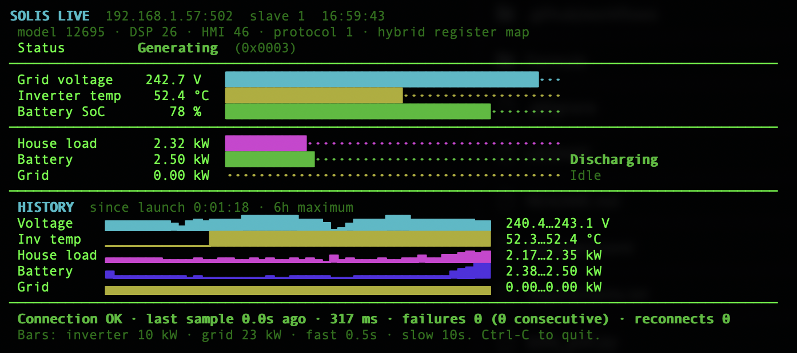
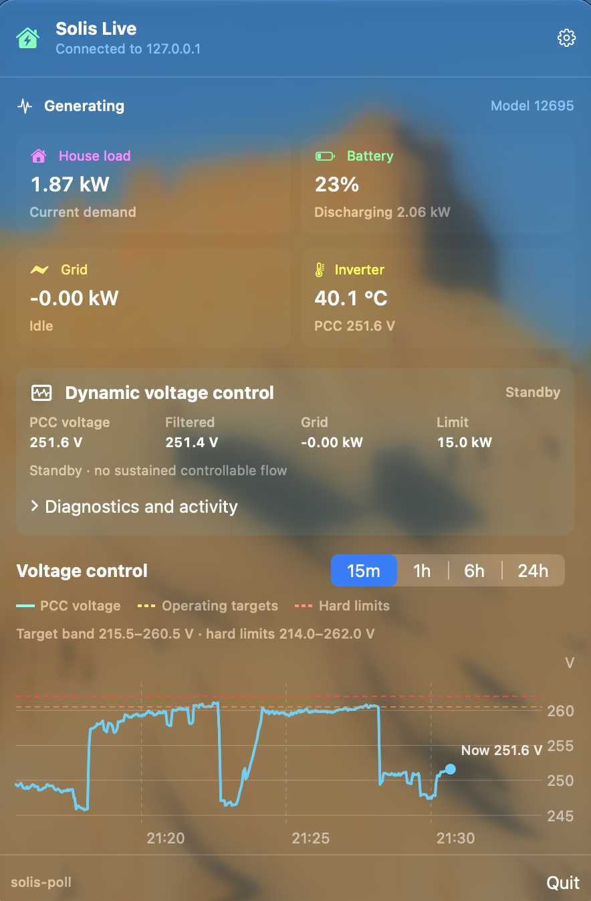

# solis-tools

[](https://github.com/jamescross91/solis-tools/actions/workflows/ci.yml)
[](https://github.com/jamescross91/solis-tools/actions/workflows/codeql.yml)
[](https://github.com/jamescross91/solis-tools/releases/latest)
[](LICENSE)

`solis-poll` is a lightweight, nmon-inspired terminal monitor for a Solis hybrid inverter exposed over Modbus TCP. It uses a persistent native Python connection and only reads input registers; it never writes to the inverter.

It provides:

- a native macOS menu-bar dashboard with live metrics and selectable charts
- live voltage, temperature, battery, house-load and grid-flow gauges
- inverter state plus decoded inverter and BMS fault indicators
- connection latency, last-sample age, failure and reconnect counters
- rolling six-hour line graphs, optionally restored after a restart
- optional CSV and JSONL recording
- optional PV power, daily generation and history
- fast power polling with slower status, temperature and energy polling

PV monitoring is **off by default**, so installations without panels do not read or display PV registers.

## Screenshots

### Terminal dashboard



### macOS menu-bar app



## Install with Homebrew

On macOS or Linux, add this repository as a Homebrew tap, then install the
latest stable release:

```sh
brew tap jamescross91/solis-tools https://github.com/jamescross91/solis-tools
brew install jamescross91/solis-tools/solis-tools
```

Then run:

```sh
solis-poll --host 192.168.1.57
```

On macOS 13 or later, the same package also installs the native menu-bar app:

```sh
solis-menubar
```

Open its menu-bar item, enter the inverter data-logger IP, and select **Save and
connect**. Select which compact house-load, battery state-of-charge, grid-flow,
temperature and PV metrics appear in the menu bar from Settings; PV generation
is available when PV is enabled. The popover provides battery, grid,
temperature, voltage, alarms, connection health and selectable six-hour charts.
Its connection settings are stored in the current macOS user's preferences. PV
remains disabled unless enabled in the app settings.

The menu-bar app retains up to six hours of chart history at a 30-second display
resolution. This keeps its popover responsive during long-running sessions.
Chart history is memory-only and is cleared whenever the app is quit and
restarted, including after an update.

The menu-bar app is built locally by Homebrew from the release source, so it
does not require a separately downloaded or unsigned application bundle. Linux
installations continue to install the terminal monitor only.

Homebrew installs Python and PyModbus in an isolated environment. Upgrade or remove it with:

```sh
brew upgrade solis-tools
brew uninstall solis-tools
```

## Install from source

- Python 3.10 or later
- PyModbus 3.10–3.x
- network access to the inverter/logger's Modbus TCP service
- a Solis hybrid inverter using the ESINV-33000 input-register layout

Install the required package in a virtual environment:

```sh
python3 -m venv .venv
source .venv/bin/activate
python3 -m pip install -r requirements.txt
```

The monitor checks the Python version and imports PyModbus before connecting. If either requirement is missing, it exits with an actionable error rather than attempting to start the dashboard.

## Run

The inverter data logger's address is deliberately mandatory. It may be an IP
address or a hostname, including an mDNS name such as `inverter.local`. When
running from a source checkout:

```sh
./solis_poll.py --host 192.168.1.57
```

Defaults are port `502`, slave ID `1`, a 0.5-second power refresh, a 10-second temperature/status refresh, a three-second timeout, 10 kW inverter capacity and 23 kW grid capacity:

```sh
./solis_poll.py \
  --host 192.168.1.57 \
  --port 502 \
  --slave 1 \
  --interval 0.5 \
  --slow-interval 10 \
  --inverter-max-kw 10 \
  --grid-max-kw 23
```

Use `--once` for a plain-text, script-friendly health check:

```sh
./solis_poll.py --host 192.168.1.57 --once --timeout 5
```

Use `--no-colour` to disable ANSI colours. Press `Ctrl-C` to stop the live
dashboard. The dashboard sizes itself to the terminal and needs at least 60
columns.

Use `--stream-json` to emit a versioned JSON object after every poll. This is
the integration interface used by the menu-bar app:

```sh
./solis_poll.py --host 192.168.1.57 --stream-json
```

## Optional PV monitoring

PV registers are not read unless `--pv` is supplied:

```sh
./solis_poll.py --host 192.168.1.57 --pv
```

This adds current PV generation, today's generated energy and a PV history graph. The PV bar uses `--inverter-max-kw` as its full-scale value.

## Recording and restored history

Append every successful sample to CSV or JSONL:

```sh
./solis_poll.py --host 192.168.1.57 --csv readings.csv
./solis_poll.py --host 192.168.1.57 --jsonl readings.jsonl
```

Both flags may be used together. Files are appended and flushed after each successful sample. On startup, the monitor restores up to the last six hours from the CSV file, or from JSONL when CSV is not configured. This lets the line graphs survive restarts while keeping their six-hour limit. Only the tail of the file is read, so startup does not slow down as the recording grows.

Recordings are append-only and are never rotated or truncated. At the default
0.5-second interval a CSV grows by roughly 17 MB a day and a JSONL by roughly
58 MB. Raise `--interval`, or rotate the files yourself, for a long-running
capture.

The parent directory must already exist. A missing or unwritable directory produces a clear error and the monitor exits.

## Status, alarms and connection health

The header shows the inverter's model and software/protocol codes. The monitor
checks the Solis type-definition register where available and rejects a
positively identified string-inverter layout. Pass `--skip-profile-check` to
continue anyway if your hybrid inverter is misidentified; decoded values may then
be meaningless, so check them against the inverter's own display.

Every decoded value is range-checked. Before the first successful poll a value
outside its physical range means the register map is wrong, and the monitor stops
and says so. Afterwards the map is proven, so an impossible value is a corrupt
response: that sample is discarded, the previous reading is retained, and the
count appears in the connection line as `rejected`.

The status area shows normal states such as `Waiting`, `Generating` and `Off-grid`. Active fault bits from inverter registers `33116–33120` are decoded to Solis alarm names and codes. BMS fault bit meanings vary between low- and high-voltage battery models, so active BMS bits are reported by exact register and bit rather than given a potentially incorrect description.

Connection health includes:

- age of the last successful sample
- round-trip poll latency
- total and consecutive failures
- successful reconnect count
- samples discarded as physically impossible

After a transient communication failure, the dashboard retains the last good reading and reconnects automatically.

## History graphs and polling

Successful readings are kept for a maximum of six hours. The graphs downsample retained readings to the terminal width and show the observed minimum and maximum.

The standard graphs are:

- grid voltage
- inverter temperature
- house load
- battery flow
- grid flow
- PV generation, only with `--pv`

Battery history is positive when discharging and negative when charging. Grid history is positive when exporting and negative when importing. Battery SoC remains a live gauge and is deliberately excluded from history.

Power-flow registers are read every `--interval` seconds. Temperature, inverter state, inverter faults and daily PV energy are refreshed every `--slow-interval` seconds. Contiguous slow registers are read together to reduce request count.

## Register assumptions

The monitor uses the Solis hybrid ESINV-33000 **input-register** map. The `mbpoll` references used by the original shell prototype were 1-based; raw Modbus PDU addresses are zero-based. The Python client preserves that conversion internally.

| Raw PDU address(es) | 1-based reference(s) | Value used |
| --- | --- | --- |
| `33000–33003` | `33001–33004` | Model, DSP, HMI and protocol codes |
| `33035` | `33036` | Today's PV generation, scaled by 10; only with `--pv` |
| `33057–33058` | `33058–33059` | Total PV power, scaled by 1000; only with `--pv` |
| `33073` | `33074` | Grid voltage, scaled by 10 |
| `33093` | `33094` | Inverter temperature, signed and scaled by 10 |
| `33095` | `33096` | Inverter state |
| `33116–33120` | `33117–33121` | Inverter fault words |
| `33135` | `33136` | Battery operating direction |
| `33139` | `33140` | Battery state of charge (%) |
| `33145–33146` | `33146–33147` | BMS fault words |
| `33147` | `33148` | House load, scaled by 1000 |
| `33149–33150` | `33150–33151` | Battery power, scaled by 1000 |
| `33263–33264` | `33264–33265` | Grid power, signed and scaled by 1000 |
| `35000` | `35001` | Inverter register-family definition, where supported |

Inverter firmware can change register availability. Check the map against the exact model before relying on the display operationally.

Register names, scales and alarms were cross-checked against the [Solis Modbus sensor documentation](https://solis-modbus.readthedocs.io/en/latest/sensors.html), the published [Solis hybrid protocol](https://www.scss.tcd.ie/Brian.Coghlan/Elios4you/RS485_MODBUS-Hybrid-BACoghlan-201811228-1854.pdf) and the MIT-licensed [community register map](https://github.com/szlaskidaniel/solar-inverter-modbus-registers).

## Development and tests

`make` creates a virtual environment and runs every check CI runs — lint,
formatting, types, version consistency and the test suite. `make help` lists the
individual targets.

```sh
make
make swift   # macOS: swift test for the menu-bar package
make app     # macOS: build the .app bundle
```

`test_solis_poll.py` covers status and fault decoding, BMS bit reporting,
recording and restoration, and chart generation against a fake client.
`test_end_to_end.py` runs the real CLI as a subprocess against
`fake_inverter.py`, covering the poll loop, reconnection, the corrupt-sample
path and recording.

### Running without an inverter

`fake_inverter.py` answers Modbus read-input-register requests from a register
bank, so the monitor and the menu-bar app both run with no hardware:

```sh
make demo                                                # dashboard against a fake inverter
python3 fake_inverter.py --port 5020 --drop-after 10      # forces a reconnect
python3 fake_inverter.py --port 5020 --corrupt-after 8    # a bad register mid-run
python3 fake_inverter.py --port 5020 --string-inverter    # the wrong register family
```

Point the menu-bar app at `127.0.0.1` port `5020` to exercise it the same way.

## Documentation

- [docs/architecture.md](docs/architecture.md) — module layout, register
  addressing, the subprocess boundary
- [docs/stream-contract.md](docs/stream-contract.md) — the `--stream-json`
  payload and how to change it
- [docs/releasing.md](docs/releasing.md) — the release runbook
- [CLAUDE.md](CLAUDE.md) — conventions and traps, for contributors and coding
  agents
- [CHANGELOG.md](CHANGELOG.md) — user-visible changes

## Contributing, support and security

Contributions are welcome through pull requests. See
[CONTRIBUTING.md](CONTRIBUTING.md) for the development workflow and required
checks, [SUPPORT.md](SUPPORT.md) for help, and [SECURITY.md](SECURITY.md) for
private vulnerability reporting. Project decisions and maintainer
responsibilities are documented in [GOVERNANCE.md](GOVERNANCE.md) and
[MAINTAINERS.md](MAINTAINERS.md).

## Troubleshooting

- **`pymodbus is not installed`** — activate the intended virtual environment and run `python3 -m pip install -r requirements.txt`.
- **Unsupported register map** — this tool supports Solis hybrid ESINV-33000 registers. Confirm the inverter model and firmware map.
- **No route from VS Code, but an external terminal works** — enable **Visual Studio Code** under **System Settings → Privacy & Security → Local Network**, then fully quit and reopen VS Code.
- **A poll fails** — check the logger address, port, slave ID and Modbus configuration. The dashboard will reconnect while retaining its last good reading.
- **`outside the expected ... range` on startup** — the register map does not match this inverter. Confirm the model, then try `--skip-profile-check` if you believe it is a supported hybrid.
- **A rising `rejected` count** — the inverter is returning occasional impossible values. Readings are still correct; the bad samples are discarded.
- **Recording fails** — create the parent directory and verify it is writable.
- **No colour or redraw** — use an interactive ANSI-capable terminal. Use `--once` for scripts and diagnostics.
